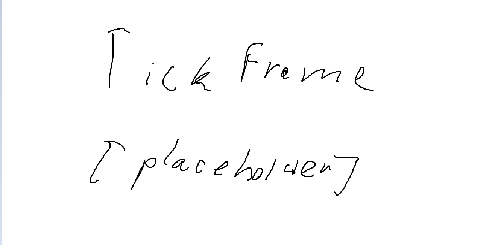
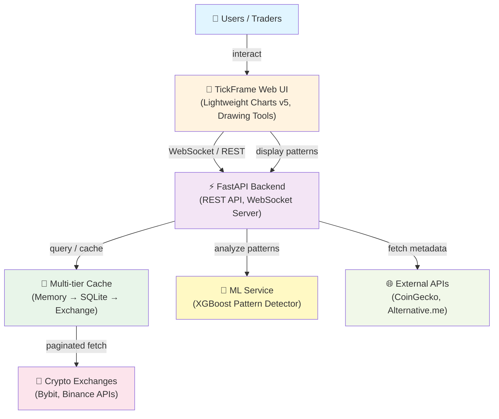

<div align="center">
  <a href="https://github.com/Fedos113/SWP_TickFrame_28_team">
    
  </a>
  <h1 align="center">SWP TickFrame — Team 28</h1>
  <p align="center">
    <strong>FastAPI-based cryptocurrency chart workstation with real-time market data, live WebSocket streaming, ML pattern detection, and advanced drawing tools.</strong>
  </p>
  <p align="center">
    <a href="#quick-start-docker">💻 Quick Start</a> •
    <a href="http://localhost:8080">🌐 Live Demo</a> •
    <a href="https://github.com/Fedos113/SWP_TickFrame_28_team/releases/tag/v2.0.0">📦 Release v2.0.0</a>
  </p>
</div>

**Latest Release:** [v2.0.0 (MVP v2)](https://github.com/Fedos113/SWP_TickFrame_28_team/releases/tag/v2.0.0) — 2026-07-06

---

## Project Goals and Description

**TickFrame** is an advanced cryptocurrency trading analysis workstation designed for technical pattern recognition and chart-based decision making. Built for traders and quantitative analysts, the platform integrates real-time market data from multiple exchanges (Bybit, Binance), provides interactive candlestick charting with 13 professional drawing tools, and leverages machine learning to automatically detect technical patterns (Head & Shoulders, Double Tops/Bottoms).

**Core goals:**
- 📊 **Real-time market analysis** with streaming WebSocket data and multi-interval support
- 🎨 **Professional drawing toolkit** (13 tools: trend lines, Fibonacci, text annotations, etc.)
- 🤖 **ML-powered pattern detection** (XGBoost-based Head & Shoulders and Double pattern recognition)
- 💾 **Persistent workspace** (SQLite-backed settings, drawings, and candle data)
- ⚡ **High-performance rendering** (<500ms pattern analysis, <1ms cache hits)
- 🔐 **Privacy-first architecture** (local data storage, no external credentials required)

---

## Built With

Core technologies powering TickFrame:

| Technology | Purpose |
|---|---|
| **FastAPI** | High-performance REST API and WebSocket server |
| **Lightweight Charts v5** | Interactive candlestick charting frontend |
| **SQLite 3** | Persistent data storage (drawings, settings, candles) |
| **XGBoost** | Machine learning classifier for pattern detection |
| **Docker & Docker Compose** | Containerized deployment (backend + ML service) |
| **ccxt** | Multi-exchange cryptocurrency data abstraction |
| **boto3** | S3 integration for ML results storage |
| **pytest** | Automated testing (unit, integration, quality requirement tests) |
| **GitHub Actions** | CI/CD pipeline (lint, type-check, test, security) |

---

## Project Context Diagram



---

## Quick Start (Docker)

### Prerequisites

- [Docker](https://docs.docker.com/get-docker/) + Docker Compose
- 2 CPU cores, 2 GB RAM recommended

### 1. Clone

```bash
git clone https://github.com/Fedos113/SWP_TickFrame_28_team.git
cd SWP_TickFrame_28_team
```

### 2. Check for port conflicts

Other applications (e.g. VS Code extensions, dev servers) may already be listening on port `8000`. Check with:

```bash
netstat -ano | findstr ":8000"
```

If you see a non-Docker process on port `8000`, the Docker container will be unreachable on that port. The docker-compose.yml maps `8080:8000` to avoid the most common conflict — adjust the host port in `docker-compose.yml` if needed.

### 3. Build and run

```bash
docker compose up --build
```

### 4. Open in browser

```
http://localhost:8080
```

For a remote VM, replace `localhost` with the VM's IP address.

> The first load may take 10–30 seconds while historical candle data is fetched from the exchange. Once cached in SQLite, subsequent loads are instant.

---

### Full Docker rebuild guide

If file changes aren't reflected after `--build`, Docker may be using cached layers. Steps for a guaranteed clean deployment:

```bash
# 1. Stop and remove all containers + network
docker compose down

# 2. (Optional) Remove old images to reclaim space
docker compose rm

# 3. Rebuild from scratch (ignores ALL cache layers)
docker compose build --no-cache

# 4. Start containers in detached mode
docker compose up -d

# 5. Verify both services are healthy
curl http://localhost:8080/api/health
curl http://localhost:8001/health

# Expected output:
# {"status":"ok"}
# {"status":"success","model_loaded":true}
```

**Why `--no-cache` is required:** Docker's `COPY . .` step caches the build context. Even when source files change, `docker compose up --build` reuses the cached layer unless `--no-cache` is explicitly passed.

**Port conflicts:** The host port in `docker-compose.yml` (`8080:8000`) is the only port you should use on your host machine. The container's internal port `8000` is only reachable from inside the Docker network. A host process on port `8000` (e.g., VS Code, Python dev server) will silently intercept traffic before Docker, even when Docker is running — use a different host port or stop the conflicting process.

---

## Local Development (No Docker)

For development or debugging without Docker:

### 1. Clone and setup

```bash
git clone https://github.com/Fedos113/SWP_TickFrame_28_team.git
cd SWP_TickFrame_28_team
```

### 2. Create virtual environment

```bash
python -m venv .venv
.venv\Scripts\Activate.ps1   # Windows
# source .venv/bin/activate  # Linux/macOS
```

### 3. Install dependencies

```bash
pip install -r requirements.txt
pip install -r tests/requirements.txt
```

### 4. Start backend server

```bash
uvicorn tickframe.backend.main:app --host 0.0.0.0 --port 8000
```

### 5. Open in browser

```
http://localhost:8000
```

> Note: ML service must be started separately for pattern analysis to work.

---

## Architecture

```
tickframe/
├── backend/
│   ├── main.py                # FastAPI app, lifespan, static mounts
│   ├── api/
│   │   ├── endpoints.py       # REST: health, coins, candles, analyze, drawings, settings
│   │   └── websocket.py       # WS: market hub, candle streams + heartbeat
│   ├── services/
│   │   ├── bybit_client.py    # Async Bybit v5 client with Binance fallback + pagination
│   │   ├── cache.py           # MemoryMarketCache with DB fallback (3-tier: mem → DB → exchange)
│   │   ├── database.py        # SQLite service (settings, drawings, candle persistence)
│   │   └── ml_client.py       # HTTP client for ML pattern analysis service
│   └── models/
│       └── schemas.py         # Pydantic models
├── frontend/
│   ├── index.html             # Main page with left drawing toolbar
│   ├── css/styles.css         # Dark/light theme, toolbar, settings panel
│   └── js/
│       ├── app.js             # Init, theme toggle, settings load/save
│       ├── charts.js          # Lightweight Charts v4, candle loading, pattern analysis
│       ├── sidebar.js         # Coin list with full ticker badges, trend-colored prices
│       ├── datafeed.js        # TradingView Charting Library datafeed adapter
│       ├── drawing-overlay.js # Canvas drawing engine: 13 tools, redact mode, undo, per-drawing settings
│       ├── toolbar.js         # Chart type switching (candle/line/area)
│       └── websocket.js       # WebSocket connection management
├── ml_service/                # ML pattern detection microservice
├── data/tickframe.db          # SQLite database (auto-created, gitignored)
├── docker-compose.yml         # tickframe + ml-service containers
└── requirements.txt
```

### Data flow

```
Exchange (Bybit/Binance)
    ↓  (paginated fetch, max 50k candles)
MemoryMarketCache (in-memory, 5s refresh)
    ↓  (merge + dedup)
SQLite (data/tickframe.db) ← survives restarts
    ↓
Frontend chart (Lightweight Charts v4, last 10k candles default zoom)
    ↓  (sliding window, step 10)
ML service → pattern detections rendered as vertical lines + text labels
```

---

## Features

| Feature | Detail |
|---|---|
| **Chart** | Lightweight Charts v4, up to 50k candles, candlestick/line/area modes |
| **Drawing tools** | 13 tools: Trend Line, H-Line, V-Line, Ray, Cross Line, Fibonacci, Price Range %, Rectangle, Circle, Arrow, Text, Brush, Redact (select/move/edit) |
| **Per-drawing settings** | Color, width (1–4), line style (solid/dashed/dotted), font size |
| **Redact mode** | Freezes chart (no scroll/zoom), crosshair hidden, enables drag-to-move/reshape |
| **Undo** | Full undo stack for add, modify (drag), and delete operations |
| **Persistence** | All drawings saved per coin to SQLite; candle data cached in DB across restarts |
| **Real-time updates** | WebSocket streams with heartbeat (5s), candle updates pushed to chart |
| **Pattern analysis** | Sliding window (50 candles, step 10) sends to ML service; results rendered as red dashed vertical lines + labels |
| **Theme** | Dark/light toggle, persisted to DB |
| **Coin sidebar** | Full ticker badges, trend-colored prices (5m candle direction), 5s auto-refresh |
| **Price formatting** | Max 6 total digits, trailing zeros stripped |

---

## API Endpoints

| Method | Path | Description |
|---|---|---|
| GET | `/api/health` | Health check |
| GET | `/api/coins` | List coins with prices and trend |
| GET | `/api/coins/{symbol}/price` | Current price |
| GET | `/api/coins/{symbol}/candles?interval=5m&limit=200` | Candlestick data (max 50000) |
| POST | `/api/analyze/{symbol}` | Pattern analysis (optional `{candles: [...]}` body) |
| GET | `/api/drawings?symbol=` | Load persisted drawings per coin |
| POST | `/api/drawings` | Save drawings per coin |
| GET | `/api/settings` | Load settings from DB |
| POST | `/api/settings` | Save settings to DB |
| WS | `/ws/market` | Market snapshot stream (5s) |
| WS | `/ws/candles/{symbol}?interval=5m` | Candle stream with heartbeat |

---

## Configuration

Bybit public endpoints work without authentication. For higher rate limits, create `.env`:

```bash
cp .env.example .env
```

Key variables:

| Variable | Default | Description |
|---|---|---|
| `ML_API_URL` | `http://ml-service:8001/predict` | ML analysis endpoint |
| `ML_CONFIDENCE_THRESHOLD` | `0.80` | Default confidence threshold |
| `ML_REQUEST_TIMEOUT` | `30.0` | ML request timeout (seconds) |

---

## Documentation Links

### Core Project Documentation
- **[Development](docs/development-process.md)** — Team workflow, git strategy, and deployment process
- **[Quality characteristics and attribute scenarios](docs/quality-requirements.md)** — QR-001 (Performance), QR-002 (Security), QR-003 (Accuracy) specifications
- **[Quality assurance](docs/testing.md)** — Testing strategy, CI pipeline, and Quality Requirement Tests (QRT)
- **[Build and deployment automation](docker-compose.yml)** — Docker Compose setup and [GitHub Actions CI/CD](.github/workflows)
- **[Architecture](docs/architecture/README.md)** — System design, component diagrams, and deployment model

### Supporting Resources
- [Definition of Done](docs/definition-of-done.md) — Sprint completion criteria
- [Roadmap](docs/roadmap.md) — Sprint-by-sprint delivery plan
- [User Stories](docs/user-stories.md) — Feature backlog and acceptance scenarios
- [User Acceptance Tests](docs/user-acceptance-tests.md) — UAT scenarios and customer validation criteria
- [Changelog](CHANGELOG.md) — Release notes and version history
- [Sprint Reports](reports/) — Weekly customer reviews (Week 2–5)
- [License](LICENSE) — MIT
