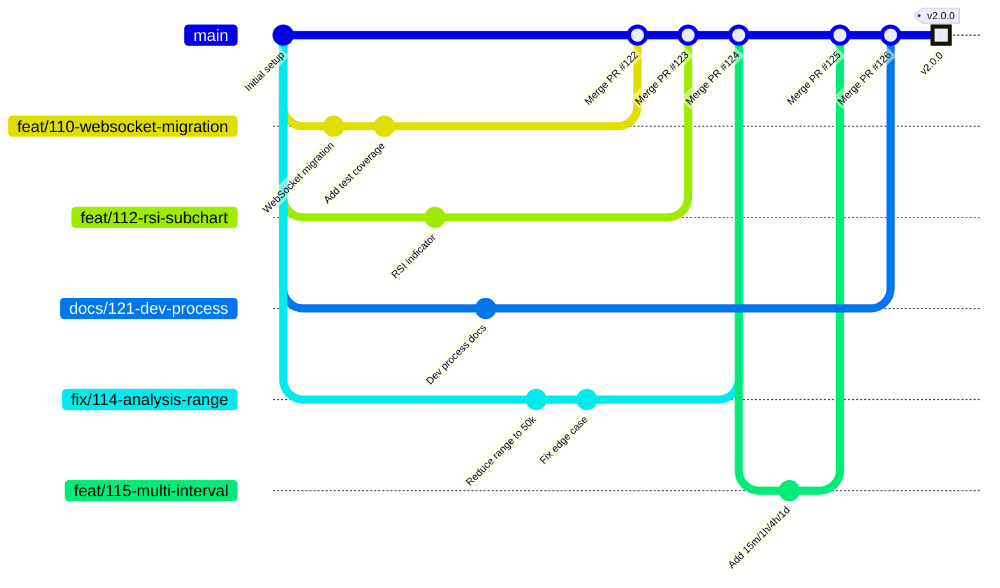

# Development Process & Configuration Management

> **Maintained artifact** — describes the team's current actual development process, git workflow, board configuration, CI pipeline, and configuration/secrets management.

---

## 1. Git Workflow

The team uses a **feature-branch workflow** with a protected `main` branch and merge commits. Every change is developed on a dedicated branch and integrated via a Pull Request with at least one approval.

### 1.1 Mermaid gitGraph



### 1.2 How the team uses this workflow

The diagram above illustrates the team's actual development cycle:

1. **`main` branch** — the single protected default branch. Direct pushes are disabled. All production releases are tagged from `main` using SemVer (`v1.0.0`, `v1.1.0`, `v2.0.0`).

2. **Feature branches** — created from `main` for each unit of work. The naming convention is `<issue-number>-short-description` (e.g., `110-websocket-migration`, `121-dev-process`). Branches live in the contributor's local clone or as remote branches on the shared repository.

3. **Parallel development** — multiple team members work on different branches simultaneously. The `gitGraph` shows four concurrent streams — feature work, fixes, and documentation — all in flight at the same time.

4. **Pull Requests** — when work is complete, the author opens a PR targeting `main`. The PR template prompts for a summary of changes, testing performed, and a changelog checklist. The PR is linked to the relevant issue.

5. **Review** — at least one other team member must approve the PR. The author cannot self-approve. Reviewers verify acceptance criteria, code quality, and CI status.

6. **Merge** — approved PRs are merged via **merge commit** (no squash, no rebase). This preserves the full branch history and makes it possible to trace which commits belong to which feature.

7. **Release** — when the Sprint is complete, a maintainer tags the latest `main` commit with a SemVer tag (e.g., `v2.0.0`) and creates a GitHub Release with changelog notes, run instructions, and a demo video link.

---

## 2. Board Configuration & Workflow States

### 2.1 Platform

The team uses **GitHub Projects** (project board) for Sprint Backlog management and **GitHub Issues** for the Product Backlog.

| Resource | Link |
|---|---|
| GitHub Projects Board | [Team 28 Board](https://github.com/users/Fedos113/projects/1/views/1) |
| Sprint 4 Milestone | [Sprint 4](https://github.com/Fedos113/SWP_TickFrame_28_team/milestone/5) |
| Issue Templates | `.github/ISSUE_TEMPLATE/` |

### 2.2 Workflow States

Every issue on the board follows one of these workflow states:

| State | Criteria to Enter | Meaning |
|---|---|---|
| **To Do** | PBI exists in the Product Backlog, not currently ready to start | The PBI remains in the Product Backlog and is not currently ready to start |
| **Ready** | PBI assigned to the current Sprint milestone, has Story Points, implementer, and reviewer | Can be picked up immediately |
| **In Progress** | Implementer starts working on the issue; linked branch exists or work has begun | Active development |
| **Review** | PR is opened linking to the issue; implementer requests review from the assigned reviewer | Implementation ready for peer review |
| **Done** (implementation PBI) | PR merged into `main`, all CI checks pass, acceptance criteria satisfied, DoD met, reviewer approved | Complete for the Sprint |
| **Done** (user-story) | All linked supporting PBIs completed and merged, story acceptance criteria satisfied, DoD met | Complete for the Sprint |

### 2.3 Issue Templates

Four issue templates are available in `.github/ISSUE_TEMPLATE/`:

- **User Story** — includes user role, desired action, expected value, and acceptance criteria
- **Other PBI** — includes description, acceptance criteria, implementer, reviewer
- **Bug Report** — includes reproduction steps, expected/actual behavior, environment
- **Course Task** — includes description and expected deliverable (not a PBI)

---

## 3. Git & Review Workflow Details

### 3.1 Issue Creation

1. A team member identifies required work and creates an issue using the appropriate template.
2. For Sprint-selected PBIs, the issue must have: clear expected outcome, acceptance criteria, Story Points (Modified Fibonacci: 1, 2, 3, 5, 8, 13, 20, 40, 100), implementer, and a different reviewer.
3. The issue is assigned to the Sprint milestone.

### 3.2 Branch Creation

1. The implementer creates a branch from `main`:
   ```bash
   git checkout main
   git pull
   git checkout -b <issue-number>-short-description
   ```
2. Example: `git checkout -b 110-websocket-migration`

### 3.3 Pull Request Submission

1. After committing changes, the implementer pushes the branch and opens a PR targeting `main`.
2. The PR title should summarise the change. The PR body follows the template:
   - Summary of changes (with "Closes #issue-number")
   - Testing performed (manual smoke tests, no secrets committed, automated checks)
   - Reviewer checklist (focused change, clean code, verified AC)
   - Changelog checkbox (user-visible change or N/A)
3. The PR links to the relevant issue via "Closes #N" in the description.

### 3.4 Review Process

1. The assigned reviewer receives the review request.
2. The reviewer checks: acceptance criteria are met, code is clean and follows conventions, CI checks pass (ruff, mypy, pytest+cov, bandit, lychee), no secrets committed.
3. The reviewer may request changes. The implementer addresses feedback with additional commits on the same branch.
4. Once satisfied, the reviewer approves the PR. The author cannot self-approve.

### 3.5 Merging

1. An approved PR is merged using **Create a merge commit** (no squash, no rebase).
2. After the merge, the linked issue is automatically closed via the "Closes #N" reference.
3. The feature branch may be deleted after merge.

### 3.6 Changelog

1. Every PR that introduces a user-visible change must include an entry in `CHANGELOG.md` under `[Unreleased]`.
2. The PR template enforces a changelog checklist — exactly one selection:
   - "Added or updated a user-visible entry in CHANGELOG.md"
   - "Not applicable because the change is not user-visible"
3. When creating a release, entries are moved into a dated SemVer section.

---

## 4. Configuration & Secrets Management

### 4.1 Secrets

| Category | Handling |
|---|---|
| **API keys / tokens** | Stored as GitHub Actions Secrets (repository settings). Never committed. |
| **`.env` files** | Listed in `.gitignore`. Never committed. |
| **Sanitized example** | `.env.example` is committed with placeholder/default values only. |
| **Bybit API** | Public endpoints work without authentication. Optional API keys for higher rate limits go in `.env`. |
| **Secrets in commits** | Zero-tolerance policy — QR-002 (Confidentiality) and QRT-002 enforce this via bandit CI checks. |

### 4.2 Ignored Files (`.gitignore`)

Key entries:
- `.env` — local environment configuration
- `__pycache__/`, `*.pyc` — Python cache
- `.venv/`, `venv/` — virtual environments
- `tickframe/data/` — legacy SQLite database (auto-created at runtime for unit-test fallback; production uses PostgreSQL via Docker Compose)
- `ml_service/data/` — ML model weights (large binaries)
- `.mypy_cache/`, `.ruff_cache/`, `.pytest_cache/`
- `*.egg-info/`, `dist/`, `build/` — packaging artifacts

### 4.3 Runtime Configuration

Configuration is supplied to the product via environment variables:

| Variable | Default | Description |
|---|---|---|
| `ML_API_URL` | `http://ml-service:8001/predict` | ML analysis endpoint |
| `ML_CONFIDENCE_THRESHOLD` | `0.80` | Confidence threshold |
| `ML_REQUEST_TIMEOUT` | `30.0` | ML request timeout (seconds) |

These are documented in `.env.example` and `README.md`. The FastAPI backend reads them via `os.getenv()` in `tickframe/backend/main.py`.

### 4.4 CI & Deployment Configuration

| Artifact | Location | Description |
|---|---|---|
| CI workflow | `.github/workflows/ci.yml` | Lint → type-check → test+coverage → bandit QA |
| Link checker | `.github/workflows/lychee.yml` | Checks all `.md` files on push/PR to main |
| Docker Compose | `docker-compose.yml` | Three containers: tickframe, ml-service, postgres |
| Dockerfile | `Dockerfile` | Main application image |
| ML Dockerfile | `ml_service/Dockerfile` | ML microservice image |

### 4.5 Lychee Exclusions

Lychee skips these link patterns (documented in `.github/workflows/lychee.yml`):
- `http://` — all non-HTTPS links
- `https://drive.google.com` — Google Drive links (require authentication)
- `https://gitlab.pg.innopolis.university` — university GitLab (requires authentication)
- `file://` — local file references
- `releases/tag/v0\.2\.0` — old tag no longer resolvable
- `releases/tag/SemVer-MVPv1` — old MVP v1 tag name
- `./assignments/` — assignment spec files (not product documentation)

All exclusions are narrowly scoped and manually verified before submission.

---

## 5. Reproducible Development Environment

The team supports two setup paths:

### 5.1 Docker Compose (Primary / Recommended)

```bash
# Build and run all containers
docker compose up --build

# For a clean rebuild (no cache)
docker compose build --no-cache
docker compose up -d
```

Opens at `http://localhost:8080`. The ML service and PostgreSQL are auto-started as companion containers.

### 5.2 Local Development (Without Docker)

```bash
# 1. Create and activate virtual environment
python -m venv .venv
source .venv/bin/activate   # Linux/macOS
# .venv\Scripts\Activate.ps1  # Windows

# 2. Install dependencies
pip install -r requirements.txt
pip install -r tests/requirements.txt

# 3. Start backend
uvicorn tickframe.backend.main:app --host 0.0.0.0 --port 8000

# 4. Start ML service (separate terminal)
cd ml_service
pip install -r requirements.txt
uvicorn app.main:app --host 0.0.0.0 --port 8001
```

Opens at `http://localhost:8080`. The ML service must be started separately.

### 5.3 Requirements

- **OS:** Linux, macOS, or Windows (WSL2 recommended for Windows)
- **Python:** 3.11+
- **Docker:** 24+ (if using containerized setup)
- **Resources:** 2 CPU cores, 2 GB RAM recommended

---

## 6. CI Process

### 6.1 Pipeline Overview

The CI pipeline runs on every push to `main` and on every PR targeting `main`:

| Job | Tool | Command | Purpose |
|---|---|---|---|
| **lint** | `ruff` | `ruff check .` | Source-code linting |
| **type-check** | `mypy` | `mypy tickframe/` | Static type checking |
| **test** | `pytest` + `pytest-cov` | `pytest --cov=tickframe --cov-report=xml tests/` | Unit + integration tests with coverage |
| **qa-check** | `bandit` | `bandit -r tickframe/ -ll` | Security static analysis (additional QA check from A4) |
| **link-check** | `lychee` | `lychee ./**/*.md` | Link checking on all Markdown files |

All jobs run sequentially and must pass before a PR can be merged.

### 6.2 Branch Protection

The default branch (`main`) is protected:
- Direct pushes are disabled
- At least one approval required before merging
- PRs must pass all CI checks before merging
- PR template is enforced

### 6.3 Deployment Automation

The team does **not** use deployment automation or continuous delivery in the CI pipeline. Deployment is manual:
1. A maintainer tags the release commit with SemVer (`v2.0.0`)
2. Creates a GitHub Release with changelog, run instructions, and demo link
3. Deploys manually to the target environment using Docker Compose

### 6.4 Latest CI Status

| Check | Latest Main Status |
|---|---|
| `lint` (ruff) | ✅ Passing |
| `type-check` (mypy) | ✅ Passing |
| `test` (pytest + coverage) | ✅ Passing |
| `qa-check` (bandit) | ✅ Passing |
| `link-check` (lychee) | ✅ Passing |

[View latest CI run](https://github.com/Fedos113/SWP_TickFrame_28_team/actions)

---

## 7. Quality Gates & Definition of Done

Every PBI must satisfy the team [Definition of Done](definition-of-done.md) before it can be marked `Done`:
- All acceptance criteria verified
- Reviewed and approved by a different team member
- PR links to the current Sprint milestone
- All CI checks pass (ruff, mypy, pytest+cov, bandit)
- CHANGELOG updated for user-visible changes
- No secrets/PII committed
- README/docs updated if needed
- Quality requirements QR-001, QR-002, QR-003 not regressed
