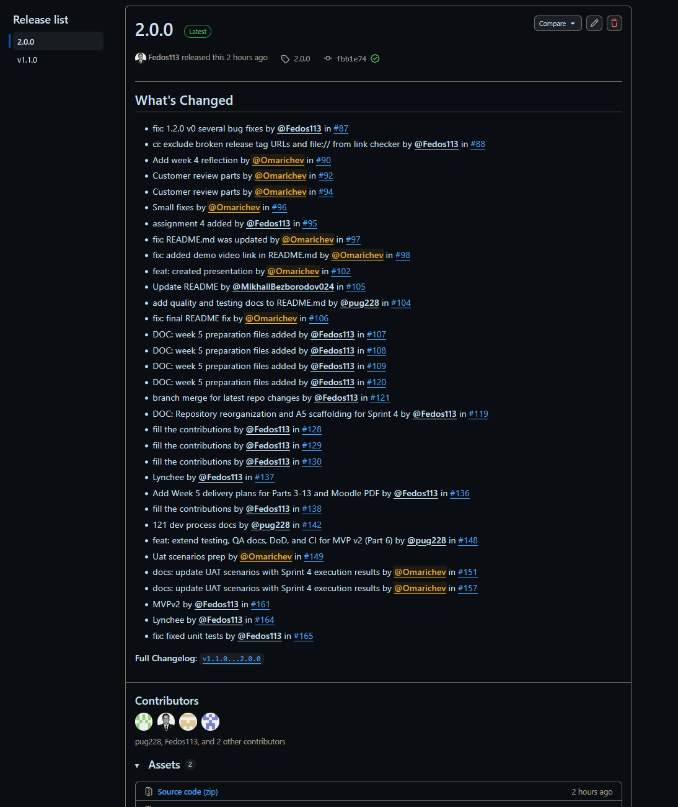
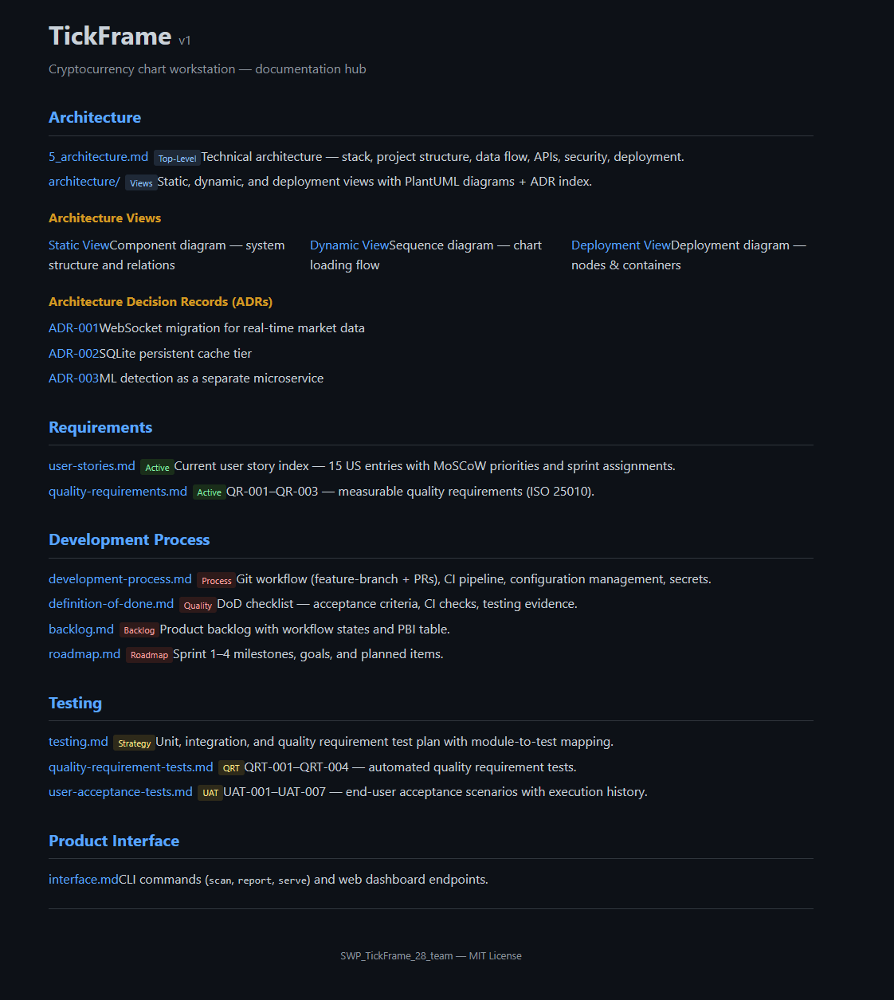

# SWP TickFrame — Week 5 Report (Assignment 5)

**Team:** SWP_TickFrame_28
**Short Description:** MVP v2 increment: WebSocket migration, SQLite caching, RSI/Volume sub-charts, multi-interval support, configurable analysis range, architecture documentation, ADRs, and hosted documentation site.
**License:** [MIT](../../LICENSE)
**Repository:** https://github.com/Fedos113/SWP_TickFrame_28_team

---

## Sprint Planning

- **Product Backlog:** https://github.com/Fedos113/SWP_TickFrame_28_team/issues
- **Sprint Backlog:** https://github.com/users/Fedos113/projects/1/views/1
- **Sprint 4 Milestone:** https://github.com/Fedos113/SWP_TickFrame_28_team/milestone/5
- **Goal:** Deliver MVP v2 — WebSocket migration, DB caching, RSI/Volume sub-charts, multi-interval support, configurable analysis range
- **Dates:** 2026-06-30 – 2026-07-06
- **Total Story Points:** 18

---

## What Was Delivered

| PBI | Title | Status | PR |
|---|---|---|---|
| [#110](https://github.com/Fedos113/SWP_TickFrame_28_team/issues/110) PBI-115 | WebSocket subscription migration | Done | — |
| [#111](https://github.com/Fedos113/SWP_TickFrame_28_team/issues/111) PBI-116 | SQLite candle caching (3-tier) | Done | — |
| [#112](https://github.com/Fedos113/SWP_TickFrame_28_team/issues/112) PBI-117 | RSI sub-chart | Partial — re-scoped to specialised library | — |
| [#113](https://github.com/Fedos113/SWP_TickFrame_28_team/issues/113) PBI-118 | Volume sub-chart | Done | — |
| [#114](https://github.com/Fedos113/SWP_TickFrame_28_team/issues/114) PBI-119 | Configurable analysis range (≤50k) | Done | — |
| [#115](https://github.com/Fedos113/SWP_TickFrame_28_team/issues/115) PBI-120 | Multi-interval support (5m, 15m, 1h, 4h, 1d) | Done | — |

Also delivered: Fear & Greed Index, revamped drawing toolbar with open-source library, ML reports with descriptions + confidence scores, 24h price change icon, WebSocket live sidebar (1s intervals).

---

## Deployed

- **URL:** http://localhost:8080 (Docker Compose)
- **How to run:** [`README.md`](../../README.md) — `docker compose up --build`

---

## Customer Feedback Response — Sprint 3/4 Review

Based on the [Sprint 3 Customer Review](../week4/customer-review-transcript.md) and the [Sprint 4 Customer Review](sprint-review-transcript.md):

| Feedback Point | Resulting PBI or Issue | Status | Response |
|---|---|---|---|
| Migrate REST polling → WebSocket subscription | [#110](https://github.com/Fedos113/SWP_TickFrame_28_team/issues/110) | Done | Live candles from Bybit/Binance via WebSocket |
| Implement database caching for candles | [#111](https://github.com/Fedos113/SWP_TickFrame_28_team/issues/111) | Done | 3-tier cache (memory → SQLite → exchange) |
| Add RSI indicator sub-chart | [#112](https://github.com/Fedos113/SWP_TickFrame_28_team/issues/112) | Partial | Manual approach failed; re-scoped to specialised library |
| Add Volume sub-chart | [#113](https://github.com/Fedos113/SWP_TickFrame_28_team/issues/113) | Done | Volume bars change with trading activity |
| Reduce analysis range to 50k | [#114](https://github.com/Fedos113/SWP_TickFrame_28_team/issues/114) | Done | Configurable slider, ≤50k limit |
| Multi-interval support (15m, 1h, 4h, 1d) | [#115](https://github.com/Fedos113/SWP_TickFrame_28_team/issues/115) | Done | Chart switching works across all intervals |
| ML reports displayed properly | — | Done | Descriptions and confidence scores shown |
| Pattern-type filtering + confidence threshold | New PBI | New | Customer request — added to backlog |
| Additional coin metrics (24h change, 5m change) | New PBI | New | Customer suggestion — low priority backlog |

---

## Docs

- [Roadmap](../../docs/roadmap.md)
- [Definition of Done](../../docs/definition-of-done.md)
- [Quality Requirements](../../docs/quality-requirements.md)
- [Quality Requirement Tests](../../docs/quality-requirement-tests.md)
- [Testing Strategy](../../docs/testing.md)
- [User Acceptance Tests](../../docs/user-acceptance-tests.md)
- [User Stories](../../docs/user-stories.md)
- [Product Backlog](../../docs/backlog.md)
- [Development Process](../../docs/development-process.md)
- [Architecture Documentation](../../docs/architecture/README.md)
- [Architecture Views — Static (PlantUML)](../../docs/architecture/static-view/diagram.puml) · [Static (SVG)](../../docs/architecture/static-view/diagram.svg)
- [Architecture Views — Dynamic (PlantUML)](../../docs/architecture/dynamic-view/diagram.puml) · [Dynamic (SVG)](../../docs/architecture/dynamic-view/diagram.svg)
- [Architecture Views — Deployment (PlantUML)](../../docs/architecture/deployment-view/diagram.puml) · [Deployment (SVG)](../../docs/architecture/deployment-view/diagram.svg)
- [ADR-001 (WebSocket)](../../docs/architecture/adr/ADR-001-websocket-migration.md)
- [ADR-002 (SQLite)](../../docs/architecture/adr/ADR-002-sqlite-persistence.md)
- [ADR-003 (Microservice)](../../docs/architecture/adr/ADR-003-microservice-architecture.md)
- [CHANGELOG](../../CHANGELOG.md)

---

## Quality Model

| ID | ISO/IEC 25010 Sub-characteristic | Key Metric | Related ADRs |
|---|---|---|---|
| QR-001 | Performance Efficiency — Time Behaviour | p95 response ≤ 500 ms | ADR-001 (WebSocket), ADR-002 (SQLite), ADR-003 (microservice) |
| QR-002 | Security — Confidentiality | Zero secrets in commits, Bandit passes | ADR-001 (WebSocket validation), ADR-003 (service boundary) |
| QR-003 | Functional Suitability — Accuracy | F2 ≥ 0.55, FPR ≤ 20% | ADR-003 (ML isolation), ADR-002 (deterministic cache) |

---

## Test Coverage

| Module | Coverage |
|---|---|
| `tickframe/backend/services/bybit_client.py` | ≥30% |
| `tickframe/backend/services/cache.py` | ≥30% |
| `tickframe/backend/services/database.py` | ≥30% |
| `tickframe/backend/services/ml_client.py` | ≥30% |
| `tickframe/backend/api/endpoints.py` | ≥30% |
| `tickframe/backend/api/websocket.py` | ≥30% |
| `tickframe/backend/models/schemas.py` | ≥30% |
| `tickframe/detection/mock.py` | ≥30% |
| `tickframe/frontend/` (JS) | Basic (Vitest) |

**Unit tests:** [`tests/unit/`](../../tests/unit/) — `test_bybit_client.py`, `test_cache.py`, `test_detection.py`, `test_schemas.py`, `test_websocket.py`, `test_database.py`

**Integration tests:** [`tests/integration/`](../../tests/integration/) — `test_api_endpoints.py`

**QRTs:** [`tests/requirements/`](../../tests/requirements/) — `test_performance.py`, `test_security.py`, `test_accuracy.py`, `test_websocket_connect.py`, `test_db_cache.py`

**Frontend JS tests:** [`tickframe/frontend/js/tests/`](../../tickframe/frontend/js/tests/) — `websocket.test.js`

---

## CI

- **Workflow:** [`.github/workflows/ci.yml`](../../.github/workflows/ci.yml)
- **Link check:** [`.github/workflows/lychee.yml`](../../.github/workflows/lychee.yml)
- **Latest run:** [CI run #28297395875](https://github.com/Fedos113/SWP_TickFrame_28_team/actions/runs/28297395875)

| Check | Tool | Target | Status |
|---|---|---|---|
| Linting (Python) | `ruff check .` | Zero errors | ✅ Pass |
| Type checking | `mypy tickframe/` | Zero errors | ✅ Pass |
| Tests (Python) | `pytest --cov=tickframe tests/` | All pass, coverage reported | ✅ Pass |
| QA | `bandit -r tickframe/ -ll` | Zero high-severity | ✅ Pass |
| Linting (JS) | `eslint tickframe/frontend/js/` | Zero errors | ✅ Pass |
| Tests (JS) | `vitest run` | All pass | ✅ Pass |
| Link check | `lychee .` | No broken links | ✅ Pass |

---

## Screenshots

All screenshots saved in [`images/`](images/).

### 1. Sprint 4 Milestone

*Sprint 4 milestone page showing 6 PBIs with assigned story points, linked to MVP v2 release.*

### 2. Project Board

*GitHub Projects board with workflow views (To Do, In Progress, In Review, Done) for Sprint 4.*

### 3. Latest CI Run

*Latest CI pipeline run on `main` — all checks passing (ruff, mypy, pytest, bandit, ESLint, Vitest, Lychee).*

### 4. SemVer Release v2.0.0

*GitHub Release page for v2.0.0 (MVP v2) with changelog summary and links to milestone, demo video, and week 5 report.*

### 5. Example Reviewed PR

*Example Sprint 4 pull request showing review approval, CI checks passing, and milestone linkage.*

### 6. Hosted Documentation Site

*GitHub Pages documentation site with overview, architecture, ADR, and process documentation.*

---

## Quality Gates Going Forward

The following checks remain enforced for all future sprints:

1. **All CI checks must pass** on branch and after merge (ruff, mypy, pytest, bandit, ESLint, Vitest, Lychee)
2. **Line coverage ≥30%** for critical backend modules
3. **Quality requirement tests must pass** — 5 QRTs automated
4. **CHANGELOG updated** for every user-visible change
5. **SemVer release** tagged at the end of each sprint
6. **Definition of Done** checklist verified before marking any PBI complete
7. **PR review by someone who did not write the code**
8. **Architecture docs and ADRs updated** if architecture changes

---

## UAT

| Scenario | Result |
|---|---|
| UAT-001: Scan and view chart patterns | ⏳ Partial — ML reports displayed; pattern filtering requested |
| UAT-002: Toggle chart timeframes | ⏳ Partial — multi-interval works; UI glitches |
| UAT-003: Export scan results | ⏳ Not demonstrated |
| UAT-004: Real-time sidebar (10 pairs) | ✅ Pass |
| UAT-005: Theme toggle | ✅ Pass |
| UAT-006: WebSocket real-time candles | ✅ Pass |
| UAT-007: RSI/Volume sub-charts | ⏳ Partial — Volume works; RSI not working |

**Key feedback:** Customer approved WebSocket migration, Volume sub-chart, multi-interval support, and analysis range. Critical request: RSI must be implemented. New requests: pattern-type filtering, confidence threshold controls, additional coin metrics.

**Resulting backlog items:** RSI re-scoped to specialised library, pattern filtering (new), coin metrics (new), UI polish (new).

---

## Sprint Review

- **Transcript:** [`sprint-review-transcript.md`](sprint-review-transcript.md) — published with customer consent
- **Summary:** [`sprint-review-summary.md`](sprint-review-summary.md)

**Date:** 2026-07-03
**Participants:** Nikolay Kuzmin (Customer), Fedor Kozhevnikov (Product Owner / Full-Stack), Daniel Zhechev (Scrum Master / ML Engineer)
**Recording:** Permitted — public transcript published

---

## Retrospective

[`retrospective.md`](retrospective.md) — Date: 2026-07-03

**Key takeaways:**
- WebSocket migration delivered; SQLite 3-tier caching implemented; Volume sub-chart working; multi-interval support unblocked
- RSI not delivered (re-scoped); UI glitches visible; pattern filtering missing; ML accuracy at ~57%

---

## Reflection

[`reflection.md`](reflection.md)

**Learning points:** Architecture documentation (PlantUML views, ADRs development-process doc), ADR traceability to quality requirements, MVP v2 delivery (WebSocket, caching, multi-interval), customer review (RSI criticality, pattern filtering gap).

**Validated assumptions:** 4 confirmed (WebSocket value, SQLite caching, multi-interval feasibility, ML threshold), 1 rejected (TradingView indicator assumptions).

**Planned response:** RSI via specialised library, pattern filtering, UI polish, DB persistence for analysis results.

---

## LLM Report

[`llm-report.md`](llm-report.md) — OpenCode (deepseek-v4-flash-free) used for code generation, test writing, CI config, documentation, ADR drafting, architecture diagrams, report drafting, and delivery plans.

---

## Status & Next Steps

**Sprint 4 is complete** — 5 of 6 PBIs delivered. MVP v2 is feature-complete except for RSI. The application now has WebSocket live candles, SQLite caching, Volume sub-chart, multi-interval switching, configurable analysis range, architecture documentation, ADRs, and hosted docs site config.

**Coming in Sprint 5:**
1. RSI sub-chart — re-implement using specialised library
2. Pattern-type filtering + confidence threshold controls
3. UI polish and glitch fixes
4. Persist analysis results to database
5. Double Top / Double Bottom ML model completion
6. Port ML detection to additional timeframes
7. Additional coin metrics (24h change, 5m change)

---

## Contributions

| Person | Role | Issues | PRs | Reviews | Testing | QA | Docs |
|---|---|---|---|---|---|---|---|
| F. Kozhevnikov ([Fedos113](https://github.com/Fedos113)) | Product Owner / Full-Stack | [#116](https://github.com/Fedos113/SWP_TickFrame_28_team/issues/116)–[#118](https://github.com/Fedos113/SWP_TickFrame_28_team/issues/118), [#131](https://github.com/Fedos113/SWP_TickFrame_28_team/issues/131)–[#135](https://github.com/Fedos113/SWP_TickFrame_28_team/issues/135), [#110](https://github.com/Fedos113/SWP_TickFrame_28_team/issues/110), [#113](https://github.com/Fedos113/SWP_TickFrame_28_team/issues/113), [#122](https://github.com/Fedos113/SWP_TickFrame_28_team/issues/122)–[#126](https://github.com/Fedos113/SWP_TickFrame_28_team/issues/126), [#158](https://github.com/Fedos113/SWP_TickFrame_28_team/issues/158), [#159](https://github.com/Fedos113/SWP_TickFrame_28_team/issues/159) | [#119](https://github.com/Fedos113/SWP_TickFrame_28_team/pull/119), [#136](https://github.com/Fedos113/SWP_TickFrame_28_team/pull/136), [#161](https://github.com/Fedos113/SWP_TickFrame_28_team/pull/161) | [#142](https://github.com/Fedos113/SWP_TickFrame_28_team/pull/142) (approved), [#148](https://github.com/Fedos113/SWP_TickFrame_28_team/pull/148) (approved), [#157](https://github.com/Fedos113/SWP_TickFrame_28_team/pull/157) (approved) | — | — | A5 scaffolding, repo reorg, frontend optimisations, lychee/roadmap/process docs, docker-compose, 5 delivery plans (Parts 3-13, Moodle PDF); MVP v2: WebSocket migration, coin icons/F&G, drawing re-architecture (lightweight-charts-drawing), volume sub-chart, DB caching, ML perf, UI redesign, timeframe switching, esbuild pipeline |
| A. Gafarov ([omarichev](https://github.com/omarichev)) | Developer / Documentation | [#143](https://github.com/Fedos113/SWP_TickFrame_28_team/issues/143), [#150](https://github.com/Fedos113/SWP_TickFrame_28_team/issues/150), [#152](https://github.com/Fedos113/SWP_TickFrame_28_team/issues/152), [#153](https://github.com/Fedos113/SWP_TickFrame_28_team/issues/153), [#154](https://github.com/Fedos113/SWP_TickFrame_28_team/issues/154) | [#149](https://github.com/Fedos113/SWP_TickFrame_28_team/pull/149), [#151](https://github.com/Fedos113/SWP_TickFrame_28_team/pull/151), [#157](https://github.com/Fedos113/SWP_TickFrame_28_team/pull/157) | [#173](https://github.com/Fedos113/SWP_TickFrame_28_team/pull/173) (approved) | UAT execution with customer | — | UAT scenarios prep + execution results (UAT-006, UAT-007, UAT-002/004 updates), context.md §21, §24 |
| A. Mindubaev ([pug228](https://github.com/pug228)) | Developer / Quality & CI | [#139](https://github.com/Fedos113/SWP_TickFrame_28_team/issues/139), [#140](https://github.com/Fedos113/SWP_TickFrame_28_team/issues/140), [#141](https://github.com/Fedos113/SWP_TickFrame_28_team/issues/141), [#144](https://github.com/Fedos113/SWP_TickFrame_28_team/issues/144), [#145](https://github.com/Fedos113/SWP_TickFrame_28_team/issues/145), [#146](https://github.com/Fedos113/SWP_TickFrame_28_team/issues/146), [#147](https://github.com/Fedos113/SWP_TickFrame_28_team/issues/147) | [#142](https://github.com/Fedos113/SWP_TickFrame_28_team/pull/142), [#148](https://github.com/Fedos113/SWP_TickFrame_28_team/pull/148) | [#119](https://github.com/Fedos113/SWP_TickFrame_28_team/pull/119) (approved), [#136](https://github.com/Fedos113/SWP_TickFrame_28_team/pull/136) (approved) | WebSocket/DB unit tests, QRT-004/005, multi-interval + analysis range tests, perf QRT fix | — | dev-process.md, architecture docs (3 views + SVGs), 3 ADRs, DoD update, context.md §21; Part 6: testing.md, QR/QRT docs, DoD, CI frontend JS, context.md §22 |
| D. Zhechev ([DaniilJechev](https://github.com/DaniilJechev)) | Scrum Master / ML Engineer | [#170](https://github.com/Fedos113/SWP_TickFrame_28_team/issues/170), [#171](https://github.com/Fedos113/SWP_TickFrame_28_team/issues/171), [#172](https://github.com/Fedos113/SWP_TickFrame_28_team/issues/172) | [#173](https://github.com/Fedos113/SWP_TickFrame_28_team/pull/173) | [#119](https://github.com/Fedos113/SWP_TickFrame_28_team/pull/119) (approved) | | | ML training pipeline (XGBoost pattern detection, feature engineering, S3 integration) |
| M. Bezborodov ([MikhailBezborodov024](https://github.com/MikhailBezborodov024)) | Developer / Frontend | | [#174](https://github.com/Fedos113/SWP_TickFrame_28_team/pull/174) | [#149](https://github.com/Fedos113/SWP_TickFrame_28_team/pull/149) (approved), [#151](https://github.com/Fedos113/SWP_TickFrame_28_team/pull/151) (approved) | | | submission.tex URLs update |

---

## Presentation

- **Public demo video:** [Demo](https://drive.google.com/file/d/1Ju0gdmtVgd91uDhgq0ZUuWojzhhVJTnU/view?usp=sharing)
- **Previous demo (Sprint 3):** [Demo](https://drive.google.com/file/d/1rOMHjHUejfUPj9k4ELTZhTgCUSINawqf/view)

---

## Artifacts and Workflow Links

- **Sprint 4 Milestone:** https://github.com/Fedos113/SWP_TickFrame_28_team/milestone/5
- **Product Backlog Board:** https://github.com/users/Fedos113/projects/1/views/1
- **Quality Requirements:** [`docs/quality-requirements.md`](../../docs/quality-requirements.md)
- **Quality Requirement Tests:** [`docs/quality-requirement-tests.md`](../../docs/quality-requirement-tests.md)
- **Definition of Done:** [`docs/definition-of-done.md`](../../docs/definition-of-done.md)
- **Testing Strategy:** [`docs/testing.md`](../../docs/testing.md)
- **User Acceptance Tests:** [`docs/user-acceptance-tests.md`](../../docs/user-acceptance-tests.md)
- **Development Process:** [`docs/development-process.md`](../../docs/development-process.md)
- **Architecture Documentation:** [`docs/architecture/README.md`](../../docs/architecture/README.md)
- **ADR Index:** [`docs/architecture/adr/`](../../docs/architecture/adr/)
- **Roadmap:** [`docs/roadmap.md`](../../docs/roadmap.md)
- **CI Workflow:** [`.github/workflows/ci.yml`](../../.github/workflows/ci.yml)
- **CHANGELOG:** [`CHANGELOG.md`](../../CHANGELOG.md)
- **Release v2.0.0:** *Not yet created* — pending final Sprint 4 merges
- **Hosted Documentation Site:** *Pending GitHub Pages enable* — `docs/_config.yml` created
- **Deployed product:** http://localhost:8080 (Docker Compose)
