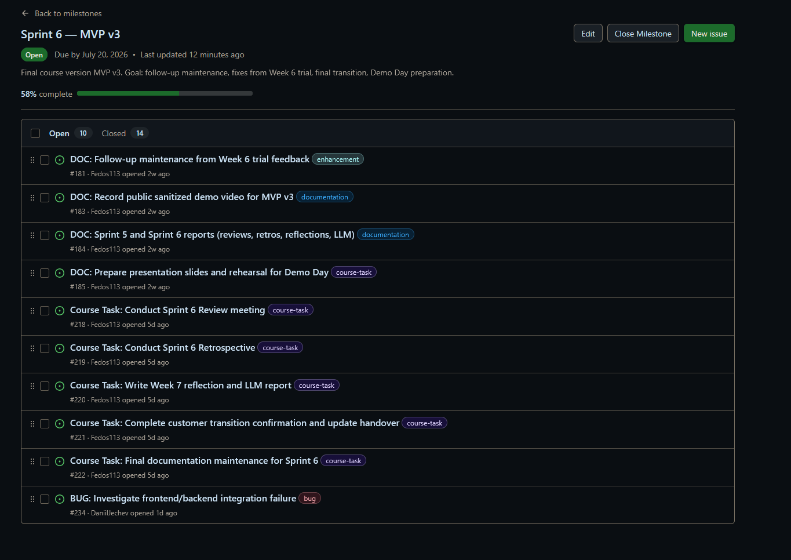
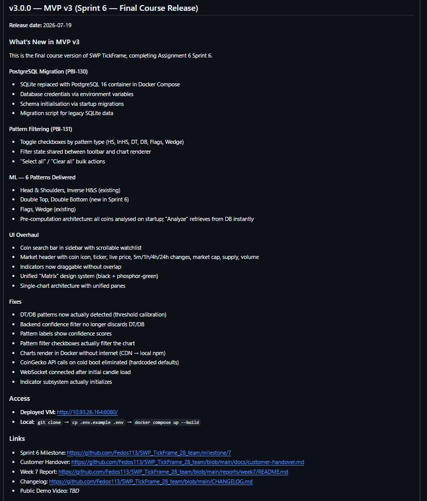
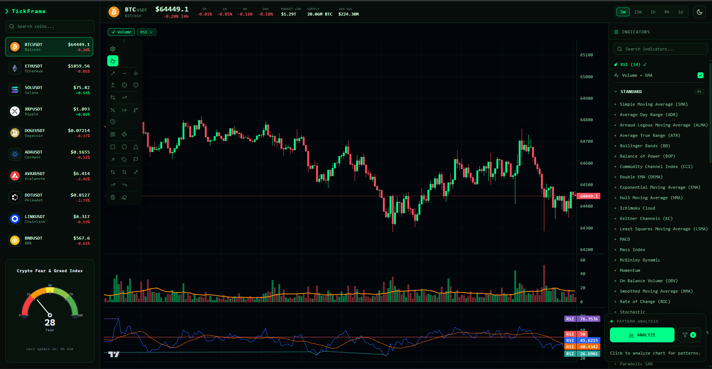

# Week 7 Public Report — Sprint 6 / MVP v3 (Assignment 7)

**Project:** SWP TickFrame — cryptocurrency chart workstation with real-time Bybit market data, WebSocket streaming, Lightweight Charts v5 candlestick charts, modular drawing toolbar, 445+ technical indicators, ML pattern analysis (6 patterns), and PostgreSQL persistence.

**Team 28** · [GitHub Repository](https://github.com/Fedos113/SWP_TickFrame_28_team)

---

## 1. Links to Previous Week and Backlog

| Artifact | Link |
|---|---|
| Week 6 report | [reports/week6/README.md](../week6/README.md) |
| Product Backlog board | [GitHub Projects — Tickframe Board](https://github.com/users/Fedos113/projects/1) |
| Sprint 6 Backlog board | [Sprint 6 filtered view](https://github.com/Fedos113/SWP_TickFrame_28_team/issues?q=milestone%3A%22Sprint+6+%E2%80%94+MVP+v3%22) |
| Sprint 6 milestone | [Sprint 6 — MVP v3](https://github.com/Fedos113/SWP_TickFrame_28_team/milestone/7) |

---

## 2. Sprint 6 Overview

| Field | Value |
|---|---|
| **Sprint Goal** | Deliver MVP v3 — follow-up maintenance, fixes from Week 6 trial, final transition, Demo Day preparation |
| **Sprint dates** | 2026-07-14 – 2026-07-20 |
| **Total Story Points** | **35 SP** (4 product PBIs + 8 course-task issues) |
| **Completed PBIs** | PBI-130 PostgreSQL migration (#201), PBI-131 Pattern filtering (#202), PBI-132 UI glitch fixes (#216), PBI-133 Scan results export (#217), PBI-134 DT/DB dual-model ML detection (#226) |
| **Scope summary** | PostgreSQL migration, pattern filtering, ML DT/DB patterns, UI overhaul (coin search, market header, indicators fix), VM deployment, customer transition confirmation, final documentation |

---

## 3. Week 7 Follow-Up Maintenance and MVP v3 Changes

The following changes were delivered in Sprint 6 as follow-up to the Week 6 trial release and customer feedback:

- **PostgreSQL migration** (PBI-130) — SQLite replaced with PostgreSQL 16 as a dedicated Docker Compose container. Startup migrations initialize the schema. Database credentials via environment variables.
- **Pattern filtering** (PBI-131) — Toggle switches next to the patterns panel let users enable/disable specific pattern types (HS, InHS, DT, DB, Flags, Wedge).
- **UI overhaul** — Sidebar with coin search allows unlimited coin addition. Indicators are now draggable without overlap. Coin metrics (5m/1h/4h change, market cap, supply) from CoinGecko + candle calculations. Market header with multi-timeframe change readouts.
- **DT/DB dual-model ML detection** (PBI-134) — Double Top and Double Bottom XGBoost detectors added alongside existing H&S pipeline. Backward-compatible API. Numba-accelerated extrema selection.
- **Pre-computation architecture** — All coins analysed by ML before project initialisation. "Analyze" retrieves pre-calculated results from PostgreSQL. First-time startup ≈3–4 min; subsequent startups instant.
- **Pattern filter fix** — Shared `_patternFilter` state between toolbar and renderer so checkboxes actually filter chart markers.
- **Confidence threshold calibration** — DT/DB thresholds calibrated to actual model output.
- **Lightweight Charts local serving** — CDN reference replaced with local npm bundle for isolated Docker environments.
- **CoinGecko cold-boot fix** — Default coin icons hardcoded; external API called in background only.
- **Single-chart architecture** — Per-coin stacked chart instances replaced with single shared instance for stability.
- **Unified "Matrix" design system** — Black + phosphor-green dark theme, white + muted-green light theme.
- **Final VM deployment** — Updated university VM with 3 containers (ML, TickFrame, PostgreSQL).

---

## 4. Product Access

| Form | Link/Instructions |
|---|---|
| **Deployed VM** | http://10.93.26.164:8080/ (university VM, deployed 2026-07-17 evening) |
| **Local via Docker** | `git clone` → `cp .env.example .env` → `docker compose up --build` |
| **Run instructions** | [README.md — Quick Start](https://github.com/Fedos113/SWP_TickFrame_28_team#docker-quick-start) |
| **Handover setup guide** | [docs/customer-handover.md — Setup and Deployment](https://github.com/Fedos113/SWP_TickFrame_28_team/blob/main/docs/customer-handover.md#setup-and-deployment) |

---

## 5. Maintained Documentation Links

| Document | Link |
|---|---|
| README | [README.md](https://github.com/Fedos113/SWP_TickFrame_28_team/blob/main/README.md) |
| Contributing Guide | [CONTRIBUTING.md](https://github.com/Fedos113/SWP_TickFrame_28_team/blob/main/CONTRIBUTING.md) |
| AI Agent Guidance | [AGENTS.md](https://github.com/Fedos113/SWP_TickFrame_28_team/blob/main/AGENTS.md) |
| Customer Handover | [docs/customer-handover.md](https://github.com/Fedos113/SWP_TickFrame_28_team/blob/main/docs/customer-handover.md) |
| Hosted Documentation Site | https://Fedos113.github.io/SWP_TickFrame_28_team/ |
| Product Backlog | [docs/backlog.md](https://github.com/Fedos113/SWP_TickFrame_28_team/blob/main/docs/backlog.md) |
| Roadmap | [docs/roadmap.md](https://github.com/Fedos113/SWP_TickFrame_28_team/blob/main/docs/roadmap.md) |
| Quality Requirements | [docs/quality-requirements.md](https://github.com/Fedos113/SWP_TickFrame_28_team/blob/main/docs/quality-requirements.md) |
| Quality Requirement Tests | [docs/quality-requirement-tests.md](https://github.com/Fedos113/SWP_TickFrame_28_team/blob/main/docs/quality-requirement-tests.md) |
| Testing Strategy | [docs/testing.md](https://github.com/Fedos113/SWP_TickFrame_28_team/blob/main/docs/testing.md) |
| Architecture Docs | [docs/architecture/README.md](https://github.com/Fedos113/SWP_TickFrame_28_team/blob/main/docs/architecture/README.md) |
| Development Process | [docs/development-process.md](https://github.com/Fedos113/SWP_TickFrame_28_team/blob/main/docs/development-process.md) |
| User Acceptance Tests | [docs/user-acceptance-tests.md](https://github.com/Fedos113/SWP_TickFrame_28_team/blob/main/docs/user-acceptance-tests.md) |
| User Stories | [docs/user-stories.md](https://github.com/Fedos113/SWP_TickFrame_28_team/blob/main/docs/user-stories.md) |
| Definition of Done | [docs/definition-of-done.md](https://github.com/Fedos113/SWP_TickFrame_28_team/blob/main/docs/definition-of-done.md) |
| Changelog | [CHANGELOG.md](https://github.com/Fedos113/SWP_TickFrame_28_team/blob/main/CHANGELOG.md) |

---

## 6. Final Transition Outcome

### Handover Level Reached

`Ready for independent use`

### Customer-Confirmation Status

`Accepted`

**Details:** The customer (Nikolay Kuzmin) reviewed and accepted the final increment during the Sprint 6 review on 2026-07-17. The increment was approved as the final course delivery with no further changes required before defence. The customer confirmed the Sprint 6 outcome was satisfactory and expressed openness to future collaboration and open-source contributions.

### What Was Transferred / Made Available

- Full source code under MIT license in the public repository
- Docker Compose deployment (3 containers: TickFrame, ML Service, PostgreSQL 16)
- Hosted documentation site at GitHub Pages
- Maintained customer handover documentation (`docs/customer-handover.md`)
- Contributing guide (`CONTRIBUTING.md`) and AI agent guidance (`AGENTS.md`)
- Complete architecture documentation with static, dynamic, and deployment views plus ADRs
- Full testing documentation, quality requirements, UAT scenarios, user stories, backlog, roadmap
- Final version deployed to university VM at http://10.93.26.164:8080/

### Remaining Blocker / Limitations

1. **Anomaly detection not delivered** — Dropped due to lack of public research and labelled data. Customer acknowledged the complexity.
2. **Single-timeframe ML (5m only)** — All 6 patterns only work on 5m candles. Multi-timeframe deferred — accepted trade-off.
3. **DT/DB precision 17–18%** — Recall ≈80% but high false-positive rate. Post-course pipeline improvement planned.
4. **Container coupling** — Frontend + backend in single container. Accepted for MVP but non-standard for production.
5. **Concurrency not stress-tested** — No locking for simultaneous "Analyze" clicks. Low risk given sub-second analysis time.
6. **NPM dependency in container** — Requires manual install, not pre-bundled in the Docker image.

### Customer Use / Deployment Evidence

The customer viewed a live demonstration of the final version during the Sprint 6 review on 2026-07-17. The fully completed version was deployed to the university VM the same evening for independent customer testing. The customer confirmed they would "run and check it" after deployment. No evidence of independent customer operation was obtained within the course period (deployment occurred at end of final review).

---

## 7. Customer Feedback Response Table — Sprint 6

| Feedback Point (from Week 6) | Source | Resulting PBI/Issue | Status |
|---|---|---|---|
| Migrate SQLite → PostgreSQL 17 with dedicated container | Sprint 5 architecture review | [#201 PBI-130](https://github.com/Fedos113/SWP_TickFrame_28_team/issues/201) — PostgreSQL infrastructure migration | ✅ Done |
| Add database credentials to env vars (DB_USER, DB_PASSWORD, DB_NAME) | Sprint 5 architecture review | Part of PBI-130 | ✅ Done |
| Implement database migrations instead of app-created tables | Sprint 5 architecture review | Part of PBI-130 | ✅ Done |
| Add pattern-type filtering and confidence threshold controls | Sprint 4 UAT + Sprint 5 confirmation | [#202 PBI-131](https://github.com/Fedos113/SWP_TickFrame_28_team/issues/202) — Pattern filtering | ✅ Done |
| Complete remaining 2 ML patterns (6 total) | Sprint 5 review | [#226 PBI-134](https://github.com/Fedos113/SWP_TickFrame_28_team/issues/226) — DT/DB dual-model | ✅ Done |
| Update VM deployment with latest version | Sprint 5 review | Deployed 2026-07-17 evening | ✅ Done |
| Additional coin metrics (5m/1h/4h change, market cap, supply) | Sprint 4 UAT | Implemented via CoinGecko + candle calcs | ✅ Done |
| Fix UI glitches (chart switching, element movement) | Sprint 4 UAT | [#216 PBI-132](https://github.com/Fedos113/SWP_TickFrame_28_team/issues/216) | ✅ Done |
| Scan results export | Sprint 4 UAT | [#217 PBI-133](https://github.com/Fedos113/SWP_TickFrame_28_team/issues/217) | ✅ Done |

---

## 8. UAT Results Summary

Results from the Sprint 6 review (2026-07-17):

| Scenario | Result | Notes |
|---|---|---|
| UAT-001: Scan and view chart patterns | ✅ Pass | 6/6 patterns working; pre-analysed in DB, instant retrieval |
| UAT-002: Toggle chart timeframes | ⏳ Partial | Switching works; ML limited to 5m timeframe |
| UAT-003: Filter patterns by type | ✅ Pass | Toggle filter next to patterns panel |
| UAT-004: Real-time price sidebar | ✅ Pass | WebSocket live prices |
| UAT-005: Theme toggle | ✅ Pass | Unchanged, still passing |
| UAT-006: WebSocket real-time candles | ✅ Pass | Live updates from Bybit, DB cache fallback |
| UAT-007: Indicator sub-charts | ✅ Pass | Indicators now movable without overlap |
| UAT-008: Configure pattern analysis range | ✅ Pass | Slider with configurable range |
| UAT-009: Sidebar coin search and addition | ✅ Pass | Infinite coin addition with search |
| UAT-010: Coin metrics header | ✅ Pass | 5m/1h/4h change, market cap, supply from CoinGecko |

Full details: [docs/user-acceptance-tests.md](https://github.com/Fedos113/SWP_TickFrame_28_team/blob/main/docs/user-acceptance-tests.md)

---

## 9. Final SemVer Release — MVP v3

[v3.0.0 — MVP v3 (Sprint 6 Final Release)](https://github.com/Fedos113/SWP_TickFrame_28_team/releases/tag/v3.0.0)

---

## 10. Changelog

[CHANGELOG.md](https://github.com/Fedos113/SWP_TickFrame_28_team/blob/main/CHANGELOG.md)

---

## 11. Public Sanitized Demo Video

[Public sanitized demo video — MVP v3](https://drive.google.com/file/d/1Otmlahg1sAH8jTMJmSWi85pBt8RAX6lz/view?usp=sharing)

---

## 12. Demo Day Preparation Summary

- Slide deck prepared and refined for Week 7 lab rehearsal
- Week 7 lab rehearsal completed (2026-07-17): 5-min presentation + 3-min Q&A
- Each team member assigned slides to present
- Pre-recorded demo segment prepared for Week 8 Demo Day (under 2 minutes)
- Full presentation timing rehearsed to fit 7-min Demo Day limit

---

## 13. Sprint Review — Summary, Transcript, and Notes

| Artifact | Link |
|---|---|
| Sprint Review summary | [reports/week7/sprint-review-summary.md](sprint-review-summary.md) |
| Sprint Review transcript | [reports/week7/sprint-review-transcript.md](sprint-review-transcript.md) (published — recording/publication permitted) |
| Sprint Review notes | [reports/week7/sprint-review-notes.md](sprint-review-notes.md) |
| Sprint Retrospective | [reports/week7/retrospective.md](retrospective.md) |
| Reflection | [reports/week7/reflection.md](reflection.md) |
| LLM Report | [reports/week7/llm-report.md](llm-report.md) |

**Recording and Publication Permissions:** Recording was permitted. Public transcript publication was permitted. The transcript is published in this repository.

---

## 14. Final Product Status

**MVP v3** (v3.0.0) is the final course version of SWP TickFrame. All planned PBIs for Sprint 6 have been delivered:

- PostgreSQL persistence with Docker Compose (3 containers)
- 6 ML patterns with pre-computation architecture (instant "Analyze")
- Pattern filtering by type
- UI overhaul: coin search, market header, draggable indicators
- VM deployment with latest version
- Complete documentation set maintained
- Customer handover accepted (`Ready for independent use` / `Accepted`)

**Known limitations:** Anomaly detection not delivered; ML only on 5m timeframe; DT/DB precision needs improvement; container architecture couples backend and frontend; concurrency not stress-tested.

---

## 15. Contribution Traceability

| Person | Role | Issues | PRs | Reviews | Testing | QA | Docs | Transition / Deployment | Demo Prep |
|---|---|---|---|---|---|---|---|---|---|
| F. Kozhevnikov ([Fedos113](https://github.com/Fedos113)) | Product Owner / Full-Stack | [#182](https://github.com/Fedos113/SWP_TickFrame_28_team/issues/182), [#201](https://github.com/Fedos113/SWP_TickFrame_28_team/issues/201), [#202](https://github.com/Fedos113/SWP_TickFrame_28_team/issues/202), [#216](https://github.com/Fedos113/SWP_TickFrame_28_team/issues/216), [#217](https://github.com/Fedos113/SWP_TickFrame_28_team/issues/217), [#232](https://github.com/Fedos113/SWP_TickFrame_28_team/issues/232) | [#231](https://github.com/Fedos113/SWP_TickFrame_28_team/pull/231), [#233](https://github.com/Fedos113/SWP_TickFrame_28_team/pull/233) | [#228 ✅](https://github.com/Fedos113/SWP_TickFrame_28_team/pull/228), [#245 ✅](https://github.com/Fedos113/SWP_TickFrame_28_team/pull/245), [#246 ✅](https://github.com/Fedos113/SWP_TickFrame_28_team/pull/246) | — | — | — | — | — |
| A. Gafarov ([omarichev](https://github.com/omarichev)) | Developer / Documentation | #218, #219, #220, #221, #222, #236, #237, #238, #242, #243, #244 | [#239](https://github.com/Fedos113/SWP_TickFrame_28_team/pull/239), [#246](https://github.com/Fedos113/SWP_TickFrame_28_team/pull/246), `sprint-review-docs` | [#241 ✅](https://github.com/Fedos113/SWP_TickFrame_28_team/pull/241) | — | — | All Week 7 reports, A7 scaffolding, customer-handover, DATABASE.md, architecture docs, Docker/config; comprehensive Week 7 report with screenshots, docs alignment for PostgreSQL/3-container/6-pattern | — | — |
| A. Mindubaev ([pug228](https://github.com/pug228)) | Developer / Quality & CI | [#183](https://github.com/Fedos113/SWP_TickFrame_28_team/issues/183), [#242](https://github.com/Fedos113/SWP_TickFrame_28_team/issues/242), [#243](https://github.com/Fedos113/SWP_TickFrame_28_team/issues/243), [#244](https://github.com/Fedos113/SWP_TickFrame_28_team/issues/244) | [#245](https://github.com/Fedos113/SWP_TickFrame_28_team/pull/245) | [#233 ✅](https://github.com/Fedos113/SWP_TickFrame_28_team/pull/233) | — | — | Week 7 report, UAT-010, release artifacts, maintained docs alignment, demo video | — | — |
| D. Zhechev ([DaniilJechev](https://github.com/DaniilJechev)) | Scrum Master / ML Engineer | [#226](https://github.com/Fedos113/SWP_TickFrame_28_team/issues/226), [#227](https://github.com/Fedos113/SWP_TickFrame_28_team/issues/227) | [#228](https://github.com/Fedos113/SWP_TickFrame_28_team/pull/228) | [#231 ✅](https://github.com/Fedos113/SWP_TickFrame_28_team/pull/231) | — | — | DT/DB integration architecture, dual-model CLI smoke test, performance report | — | — |
| M. Bezborodov ([MikhailBezborodov024](https://github.com/MikhailBezborodov024)) | Developer / Frontend | [#240](https://github.com/Fedos113/SWP_TickFrame_28_team/issues/240) | [#241](https://github.com/Fedos113/SWP_TickFrame_28_team/pull/241) | [#239 ✅](https://github.com/Fedos113/SWP_TickFrame_28_team/pull/239) | — | — | — | — | — |

---

## 16. Screenshots

Screenshots evidence for inspectable Week 7 artifacts:

### Sprint 6 Milestone

*Sprint 6 milestone with goal, dates, and issue list*

### MVP v3 Release (v3.0.0)

*v3.0.0 MVP v3 Final Release on GitHub*

### Final Product Access — VM Deployment

*SWP TickFrame running on university VM at http://10.93.26.164:8080/*

### Example Reviewed PR — Dual ML Model Integration

*PR #230 — Dual ML model integration with reviewed approval*
